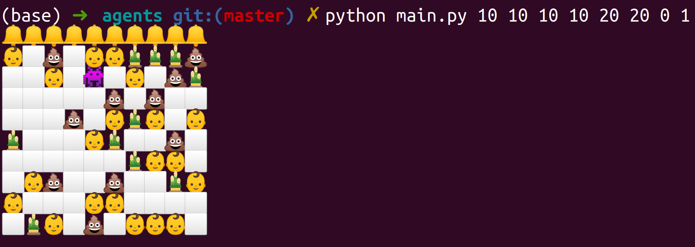
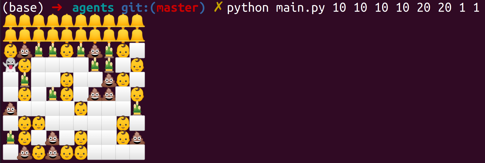

# Proyecto de Simulacion

## Agentes 

## Marcos Antonio Maceo Reyes, Grupo 2

### Principales ideas seguidas para la implementación del Sistema

Basándonos en nuestros conocimientos alcanzados y las bondades del lenguaje decidimos implementar el trabajo en python. 
Nos guiamos por las siguientes pautas para dar respuesta a la simulación:
1. Se modelan los elementos del entorno de forma tal que se generen lo mas aleatoriamente posible
2. Se adiciona al entorno los corrales.
3. Se adiciona al entorno el comportamiento de los bebes.
4. Se adiciona al entorno los basura.
5. Se adiciona al entorno los obstáculos.
6. Se adiciona el comportamiento de los robots.

### Ideas seguidas en la implementacion

Para la implementación nos basamos en 2 módulos fundamentales:
`types_defined`: Este está definido por un conjunto de clases y es aquí donde se define el comportamiento de 
cada una de las celdas del tablero. En este módulo se encuentran implementadas las siguientes clases:
    `Cell`: Clase básica que representa una celda básica, representando además una celda abstracta, la cual contiene 
    métodos comunes a todas las clases que se describen a continuación:
    `Blank`: Representa una casilla en blanco en nuestro tablero
    `Obstacle`: Representa un obstáculo en el tablero
    `Dirt`: Representa basura en el tablero
    `Corral`: Representa a los corrales que contendrán luego a los bebés
    `Child`: Representa en nuestro tablero una casilla que contiene un bebé
    `Robot`: Esta es la clase básica de nuestros agentes, quienes heredan directamente de esta y esta a su vez contiene 
    todos los métodos y elementos comunes de nuestros agentes.
    `RobotOne`: Representa nuestro primer agente, el cual tiene una mezcla entre agente proactivo y reactivo, con objeto
     de acercarse a los objetivos del problema. 
    `RoborTwo`: De forma semejante a su compañero, este agente mezcla caracteristicas de agentes proactivos y reactivos,
    movilizándose de manera aleatoria
    
`Board`: Este módulo contiene las reglas generales de la simulación.

Los elementos del trablero se generan en el siguiente orden:
1. Se acomodan los corrales
2. Se acomodan los bebés
3. Se acomoda la basura
4. Se acomodan los obstáculos
5. Se posiciona al robot.

Una celda del ambiente está representada por alguna de las clases listadas en el módulo `types_defined`. Para cada una 
de estas clases, con objeto de lograr una mejor representación visual, se usaron emojis para diferenciar algunos de los 
estados de la simulación.

Así luce un tablero recién creado utilizando el robot 0 o más inteligente:

Por otra parte así luce un tablero recién creado usando el robot 1 o más aleatorio:

    
### Consideraciones obtenidas

Como se aprecia en las imágenes siguientes, el robot que posee un movimiento más ajustado a las necesidades del 
problema cumple en mayor medida con el objetivo, mientras que el otro gana de acuerdo a su movimiento, el cual es 
aleatorio se basa únicamente en el movimiento actual.

Acá se pueden observar los resultados anteriormente explicados del robot 0 o más inteligente:

Acá se pueden observar los resultados anteriormente explicados del robot 1 o más aleatorio:

